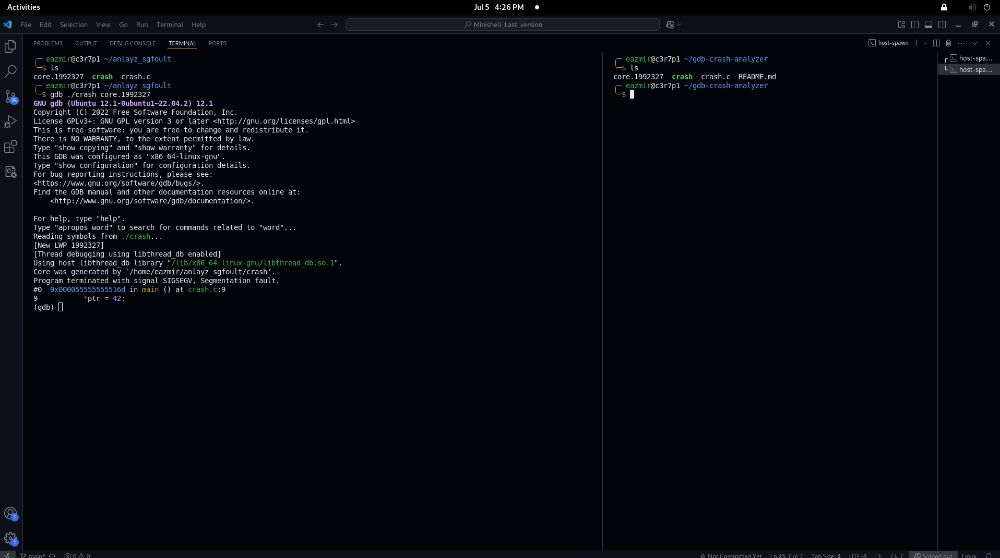

# Generating Core Dumps with GDB

When your program crashes with a segmentation fault but no core file is generated (due to apport or system settings),  
you can create one manually using GDB.

First, compile your program with debug symbols using:  
`gcc -g your_program.c -o your_program`

Then run it inside GDB:  
`gdb ./your_program`

Once inside GDB, type:  
`run`  
to start the program.

When it crashes, type:  
`generate-core-file`  
to create a core dump file, then type:  
`quit`  
to exit GDB.

You can analyze the core dump later using:  
`gdb ./your_program core.XXXXX`

For example, GDB might show:  

The core file (e.g., `core.1992327`) will be saved in your current directory and can be used for post-mortem debugging.

If you'd rather enable automatic core dumps from the system and you have the right permissions,  
run this before executing the program:  
`ulimit -c unlimited`

Then run your program as usual:  
`./your_program`  
A core file will be generated automatically if the program crashes.

